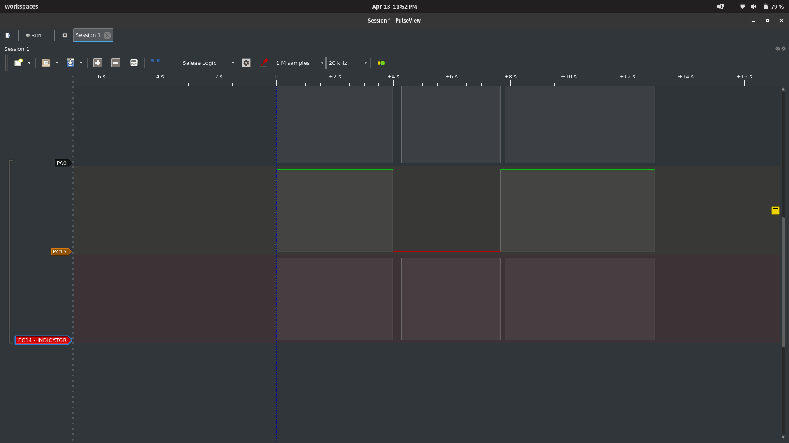

# Project Overview
This is project i build to learn how to implementing Interrupt in my Button Project..
as a beginner, commonly we used POLLING Method to hold our BUTTON STATE. 
But, in real case deployment, it will be very danger because it makes CPU stuck and do not do anything.

## Why Interrupt?
Interrupt is the way we let CPU do it MAIN work and just response is there a "SIGNAL" from the External Interrupt Line.
For example: 
	Our system has MAIN TASK is to monitoring and control 3 phase motor. That is the MAIN FOCUS of CPU. 
	If we use POLLING, for each some time we set, the CPU will asking is there a interrupt?
	And while CPU do that, imagine if the 3 phase motor suddenly has spike electrical parameter like
	(Voltage, Current, Ect), CPU will miss that EVENT and it's DANGER for CRITICAL SYSTEM
	So with INTERRUPT, we let CPU do it MAIN TASK, and we call the CPU JUST WHEN THERE'S A IMPORTANT TRIGGER
	Like: Emergency Button, or others critical signal that MUST to RESPON AS FAST AS PRIORITY LEVEL SET

## How to run this project?
You can run this project by follow this steps:
	1. Download this REPO.
	2. Import to your STM32CubeIDE.
	3. Open folder Core->Src->main.c
	4. Start to experiment
### Important Note!!!
- I use STM32F411CEU6, so if you use another CHIP, make sure to change the CMSIS's header file
```c
	/* USER CODE BEGIN Includes */
	
	#include "stm32f411xe.h" // Change this line of code to matching with your STM32 CHIP
	#include "stdint.h"

	/* USER CODE END Includes */
```

- ALWAYS REFER TO YOUR MANUAL REFERENCE OF YOUR STM32 CHIP
- You can see the screenshot of signal that i use logic analyzer to make sure the signal is looks like our code logic
	- Open: 

## Another Documentations
YT: [PenuDjira](https://www.youtube.com/@PenuDjira)
<a href="https://www.youtube.com/channel/@PenuDjira?sub_confirmation=1"> </a>


